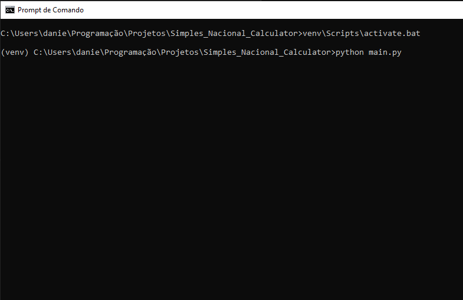

# Readme

This project is for the calculation of "Simples Nacional", tax regime for little companies in Brazil.

# Dependêncies

- Python 3
- Flask (Python module)
- Request (Python module)

# Getting started

First clone the project, for the project works on your local machine it is necessary to install 1 module of Python. Using the command:

> git clone https://github.com/dancorrea86/Simples_Nacional_Calculator

Or dowloading the project in the github page:

> https://github.com/dancorrea86/Simples_Nacional_Calculator

With Python installed in your machine, install the module Virtualenv, using the terminal, go to the project paste and create the "venv", using the command:

> pip install virtualenv

And after the installation, in the paste of the project, create de "venv" and activate the "venv" with the commands:

> python -m venv venv

> venv\Scripts\activate.bat

Now install the flask module in the "venv", using the command:

> pip install Flask

And install the request module:

> pip install requests

# How to use

With the project in your local machine, open the index.html file in the browser

Open the project paste in the terminal, and with the "venv" activate run the file "main.py", with the command:

> python main.py

The browser with the file 'index.html' is going to be the client-side and the python file "main.py" going to be the server-side the receives the http form and use the file "script.py" to make the calculation, that will return to the browser.

